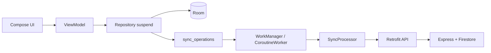
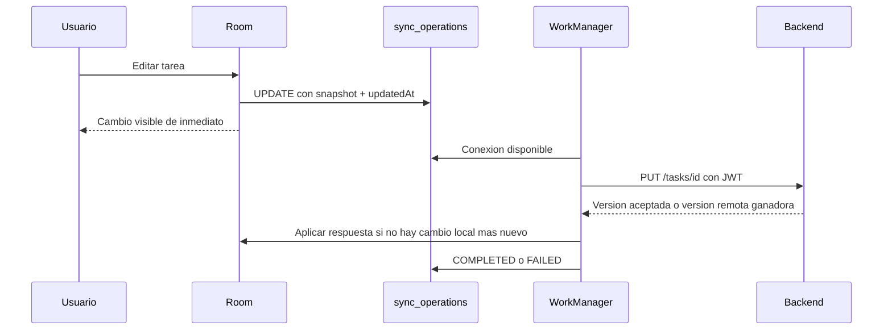

# TaskPoint: decisiones de arquitectura y sincronizacion

Este documento describe la arquitectura que esta implementada hoy en TaskPoint, las decisiones tomadas y las etapas que aun faltan. El objetivo es que la aplicacion se mantenga entendible, local-first y segura sin introducir capas innecesarias.

## 1. Principios que guian la aplicacion

TaskPoint sigue una arquitectura **MVVM + Repository**:

- La UI Compose solo muestra estado y comunica eventos del usuario.
- Cada `ViewModel` conserva el estado de pantalla y coordina casos de uso desde `viewModelScope`.
- Los repositorios contienen el acceso a datos y no son llamados directamente desde los composables.
- Room es la fuente de verdad de tareas y rutinas. La pantalla no depende de que exista conexion.
- Retrofit se usa solo detras de repositorios o del procesador de sincronizacion.
- Hilt construye y comparte las dependencias de aplicacion.



La separacion evita que una pantalla conozca detalles de SQLite, HTTP, JWT o Firebase. Tambien permite probar el `ViewModel` con un repositorio falso y cambiar la implementacion de datos sin reescribir la UI.

## 2. Room como fuente de verdad local

### Que datos viven en Room

Room almacena:

- `tareas`: tareas reales del usuario autenticado.
- `rutinas`: rutinas reales del usuario autenticado.
- `sync_operations`: cola persistente de cambios que todavia deben llegar al backend.
- Catalogo de referencia: categorias, tiendas y ofertas.

Las tareas y rutinas ya no se cargan desde JSON ni se mantienen solo en memoria. Los unicos JSON conservados son el catalogo necesario para presentar categorias, tiendas y ofertas. Ese catalogo se importa a Room por `OfferCatalogImporter`; no representa tareas, rutinas ni usuarios ficticios.

Cada tarea y rutina incluye `userId`, `syncStatus` y `updatedAt`. El `userId` impide mezclar datos de cuentas distintas en el mismo dispositivo. `updatedAt` permite ordenar cambios y resolver conflictos de forma inicial mediante ultima escritura valida.

Los DAOs exponen operaciones `suspend` y, cuando corresponde observar datos, `Flow`. No se permite una consulta de Room bloqueante desde la UI.

Archivos principales:

- `app/src/main/java/com/example/apk_mock/data/local/TaskPointDatabase.kt`
- `app/src/main/java/com/example/apk_mock/data/local/dao/`
- `app/src/main/java/com/example/apk_mock/data/local/entity/`
- `app/src/main/java/com/example/apk_mock/data/repository/RoomTareaRepository.kt`
- `app/src/main/java/com/example/apk_mock/data/repository/RoomRutinaRepository.kt`

### Escritura local atomica

Al crear, editar o borrar una tarea/rutina, el repositorio realiza dos acciones en una unica transaccion de Room:

1. Guarda el cambio local visible para el usuario.
2. Inserta su operacion equivalente en `sync_operations`.

Por ejemplo, al editar una tarea se persiste la tarea con `PENDING_UPDATE` y se encola un `UPDATE` con una copia JSON de los datos y de su `updatedAt`. Si la app se cierra luego, Room conserva ambos datos y el cambio no se pierde.

Esta es la base del enfoque **local-first**: guardar localmente no depende de la red.

## 3. Corrutinas: regla de no bloquear el hilo principal

La regla es estricta: Room, red, preferencias cifradas, archivos de fotos y programacion de trabajo se ejecutan fuera del Main Thread.

La aplicacion lo resuelve asi:

- Los contratos de repositorio son `suspend`.
- Los `ViewModel` llaman a esos contratos dentro de `viewModelScope.launch`.
- Los repositorios usan `withContext(Dispatchers.IO)` para las operaciones de I/O.
- Retrofit expone metodos `suspend`; sus llamadas se hacen desde repositorios/procesadores en contexto de I/O.
- `SecureSessionStorage` accede a `EncryptedSharedPreferences` mediante funciones `suspend` en I/O.
- Las fotos se crean o eliminan en I/O.
- La sincronizacion usa `CoroutineWorker`, cuyo `doWork` es suspendible.

No se usa `runBlocking`, `GlobalScope` ni llamadas sincrónicas de Retrofit. Esto evita congelamientos al iniciar sesion, guardar una tarea, abrir Room o perder conectividad.

El patron esperado para una pantalla es:

```kotlin
fun save() {
    viewModelScope.launch {
        _uiState.update { it.copy(isLoading = true) }
        val result = repository.save(...)
        _uiState.update { it.copy(isLoading = false) }
    }
}
```

El composable observa `uiState`; no debe ejecutar consultas ni requests durante la composicion.

## 4. Hilt y el alcance singleton

Antes habia un contenedor manual. Ahora la aplicacion usa Hilt, inicializado por `TaskPointApplication` con `@HiltAndroidApp` y por `MainActivity` con `@AndroidEntryPoint`.

`AppModule` registra en `SingletonComponent` las dependencias que deben existir una sola vez por proceso:

- `TaskPointDatabase`.
- `RetrofitClient` y las APIs Retrofit.
- `SecureSessionStorage`.
- `TaskPhotoStorage`.
- Importador del catalogo de ofertas.
- Repositorios de Room y autenticacion.
- `SyncProcessor` y `SyncScheduler` (por inyeccion de constructor).

Usar singleton aqui evita abrir varias bases Room, crear varios clientes HTTP o competir por dos procesadores de cola. No significa guardar estado de pantalla global: los `ViewModel` siguen teniendo su ciclo de vida propio.

`SyncProcessor` incorpora ademas un `Mutex`, por lo que dos pedidos de sincronizacion dentro del mismo proceso no pueden enviar la misma operacion a la vez. WorkManager usa trabajo unico (`ExistingWorkPolicy.KEEP`) para evitar multiples workers de sincronizacion simultaneos.

Archivos principales:

- `app/src/main/java/com/example/apk_mock/TaskPointApplication.kt`
- `app/src/main/java/com/example/apk_mock/di/AppModule.kt`
- `app/src/main/java/com/example/apk_mock/data/sync/SyncProcessor.kt`
- `app/src/main/java/com/example/apk_mock/data/sync/SyncScheduler.kt`

La version de Hilt es `2.59.2`: se eligio porque la version anterior no era compatible con Android Gradle Plugin 9.2.1 del proyecto.

## 5. Autenticacion, sesion y seguridad

El backend implementa:

- `POST /auth/register`
- `POST /auth/login`
- `GET /auth/me`

Al registrar o iniciar sesion, Android llama a `AuthApi` mediante `RemoteAuthRepository`. El backend almacena en Firestore solo `passwordHash` generado con bcrypt, nunca la contraseña plana, y emite un JWT.

Android guarda el JWT y los datos minimos del usuario en `EncryptedSharedPreferences`, encapsulado en `SecureSessionStorage`. Al iniciar la aplicacion, `SessionViewModel` restaura la sesion; por eso una sesion valida navega al inicio y una inexistente al onboarding.

El login y el registro **no** se agregan a `sync_operations`: son operaciones online necesarias para crear/obtener la sesion y el token. Tampoco se sincroniza el catalogo de ofertas.

## 6. Retrofit y contratos de red

`RetrofitClient` es una dependencia singleton. Configura OkHttp, timeouts, logging basico y Gson; despues expone APIs separadas:

- `AuthApi`
- `TaskApi`
- `RoutineApi`
- APIs de referencia del catalogo

Las APIs usan DTOs, no entidades Room ni modelos de UI. Los datos se transforman mediante mappers:

```text
DTO de red <-> modelo de sincronizacion
Entidad Room <-> modelo de dominio
```

Las llamadas protegidas envian `Authorization: Bearer <JWT>`. El procesador obtiene el header desde el almacenamiento seguro solo al momento de sincronizar; no se guarda el token dentro de la cola.

Esta separacion evita filtrar detalles de HTTP hacia la UI y evita que un cambio del backend rompa directamente las pantallas.

## 7. Sincronizacion local-first

### Operaciones que se encolan

La cola contiene solamente cambios de negocio que se pueden realizar sin red:

| Entidad | Operaciones |
| --- | --- |
| Tarea | `CREATE`, `UPDATE`, `DELETE` |
| Rutina | `CREATE`, `UPDATE`, `DELETE` |

El renombre de una rutina tambien encola los `UPDATE` de las tareas que guardan su nombre de rutina.

Cada `SyncOperationEntity` incluye:

- Usuario propietario.
- Tipo de entidad e identificador estable UUID.
- Tipo de operacion.
- Snapshot JSON para create/update.
- Estado, contador de intentos y ultimo error.
- Fecha de creacion/actualizacion.

El snapshot contiene el `updatedAt` de la entidad exacta que genero la operacion. No se reconstruye con el estado actual al reintentar: asi una operacion vieja no se transforma accidentalmente en una nueva.

### Estados de la cola

```text
PENDING -> IN_PROGRESS -> COMPLETED
                  |
                  v
                FAILED
```

- `PENDING`: cambio local aun no enviado.
- `IN_PROGRESS`: operacion tomada por el procesador. Se vuelve a considerar en un inicio posterior si la app se cerro durante el envio.
- `COMPLETED`: backend confirmo la operacion; se conserva por ahora como historial limpiable.
- `FAILED`: fallo registrado, con `attempts` incrementado y un mensaje seguro, sin guardar secretos.

Si falla la creacion o edicion de una entidad, esa entidad local queda en Room y se marca `FAILED`. Si falla un borrado, la entidad ya no aparece localmente, pero la operacion de borrado permanece en la cola para reintentar contra el servidor.

### Procesador y conflictos iniciales

`SyncProcessor` lee las operaciones de un usuario en orden de creacion y procesa una por vez. Para cada una:

1. Marca la operacion `IN_PROGRESS`.
2. Llama al endpoint Retrofit correspondiente.
3. Si se confirma, marca la operacion `COMPLETED` y la entidad como `SYNCED`.
4. Si llega una respuesta de una version remota mas nueva, solo la aplica si la entidad local no fue modificada despues del snapshot enviado.
5. Si falla, conserva los datos locales y registra el error.

El backend guarda tareas y rutinas debajo del usuario autenticado en Firestore y compara `updatedAt` dentro de una transaccion. Para create/update aplica **last write wins**: una escritura con timestamp mas viejo no reemplaza una version remota mas nueva.



### Conexion y reintentos

`SyncScheduler` programa un `PendingSyncWorker` unico cuando se crea, edita o borra una tarea/rutina y al restaurar/iniciar una sesion.

El worker:

- Requiere `NetworkType.CONNECTED`.
- Es un `CoroutineWorker`, por lo que no bloquea el hilo de UI.
- Usa backoff exponencial para errores de red y errores HTTP `5xx`.
- No reintenta automaticamente errores HTTP `4xx`, porque suelen requerir una accion del usuario o una correccion de datos.

## 8. Backend

El backend es Express con Firebase Admin SDK y Firestore. Las rutas de tareas y rutinas requieren JWT y trabajan solamente sobre los datos del usuario del token:

```text
users/{userId}/tasks/{taskId}
users/{userId}/routines/{routineId}
```

Endpoints disponibles:

```text
GET    /tasks
POST   /tasks
PUT    /tasks/:id
DELETE /tasks/:id

GET    /routines
POST   /routines
PUT    /routines/:id
DELETE /routines/:id
```

Esto evita que el cliente envie un `userId` arbitrario para leer o modificar datos de otra cuenta.

## 9. Estado actual y limites conocidos

La base local-first, la cola y el reintento por conectividad estan implementados. Aun hay decisiones/protecciones a completar:

1. **Conflictos de borrado.** Create/update usan `updatedAt`, pero un `DELETE` remoto aun no usa tombstones. La siguiente mejora debe enviar el timestamp del borrado y conservar una marca de eliminado para que un delete viejo no borre una version remota mas nueva.
2. **Fallos permanentes.** Un `FAILED` por `4xx` queda registrado correctamente, pero necesita una categoria de error permanente o una accion de reintento/descartar. De otro modo podria volver a intentarse cuando se programe una nueva sincronizacion y frenar operaciones posteriores para conservar el orden.
3. **Descarga inicial y cambios de otros dispositivos.** Hoy se envian pendientes; falta una etapa de pull controlado desde `GET /tasks` y `GET /routines` al iniciar sesion, aplicando las mismas reglas LWW.
4. **Fotos.** `photoPath` es una ruta local del dispositivo. Para sincronizar fotos entre dispositivos se necesita subida de archivos (por ejemplo Firebase Storage) y guardar una URL remota, no una ruta local.
5. **Logout.** Falta decidir la politica: conservar datos locales separados por `userId` para uso posterior, o borrarlos con la cola al cerrar sesion. La implementacion debe incluir siempre la eliminacion del JWT.
6. **Observabilidad de sincronizacion.** Falta una pantalla/indicador de estado para que el usuario pueda ver pendientes, fallos y reintentar manualmente.

## 10. Proximas etapas recomendadas

1. Completar LWW para `DELETE` con tombstones y pruebas de conflicto.
2. Separar fallos transitorios de permanentes y permitir reintento/descartar manualmente.
3. Implementar pull inicial y conciliacion Room/Firestore por `updatedAt`.
4. Definir e implementar logout y limpieza local por usuario.
5. Agregar pruebas unitarias para `SyncProcessor`, repositorios y `ViewModel`; pruebas de integracion del backend; y una prueba manual Android con backend real.
6. Documentar contrato HTTP definitivo, politicas de fotos y manejo de errores para entrega.

## 11. Verificaciones realizadas

- Los endpoints de autenticacion y CRUD protegido fueron verificados contra backend/Firebase durante el desarrollo.
- Se verifico que un `updatedAt` viejo no sobrescriba una actualizacion mas nueva en backend.
- `:app:compileDebugKotlin` y KSP finalizaron correctamente luego de incorporar Hilt, la cola y WorkManager.

El empaquetado APK completo debe ejecutarse tambien en Android Studio o un entorno con acceso al SDK Android sin restricciones de sandbox.
